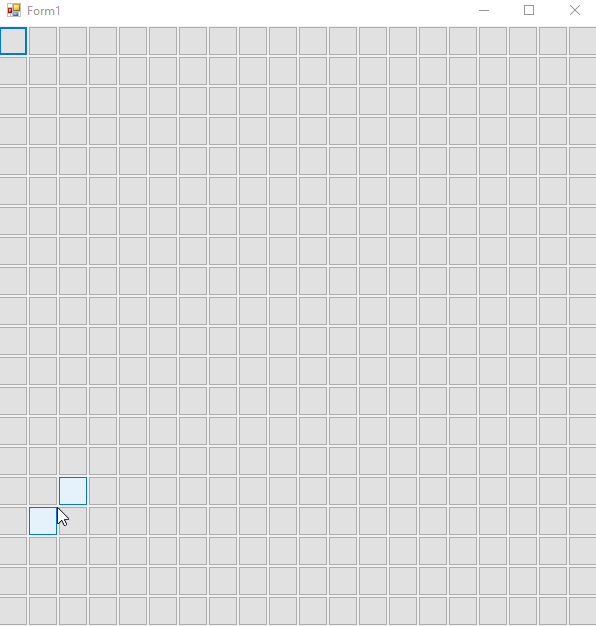

# [.NET Framework] Minesweeper
## Game originally created on 2020-05.
#### Last opened with Microsoft Visual Studio 2017. .NET Framework version: 4.6.1 ####

Copy of original Minesweeper with 3 different difficulty levels. Game created for education purposes.

Controls and instructions: Left mouse click to open a square. Press B on keyboard for toggle flag mode. When in flag mode cursor will change accordingly and you will be able to place flags. After placing flags on all bombs on map you win the game.

